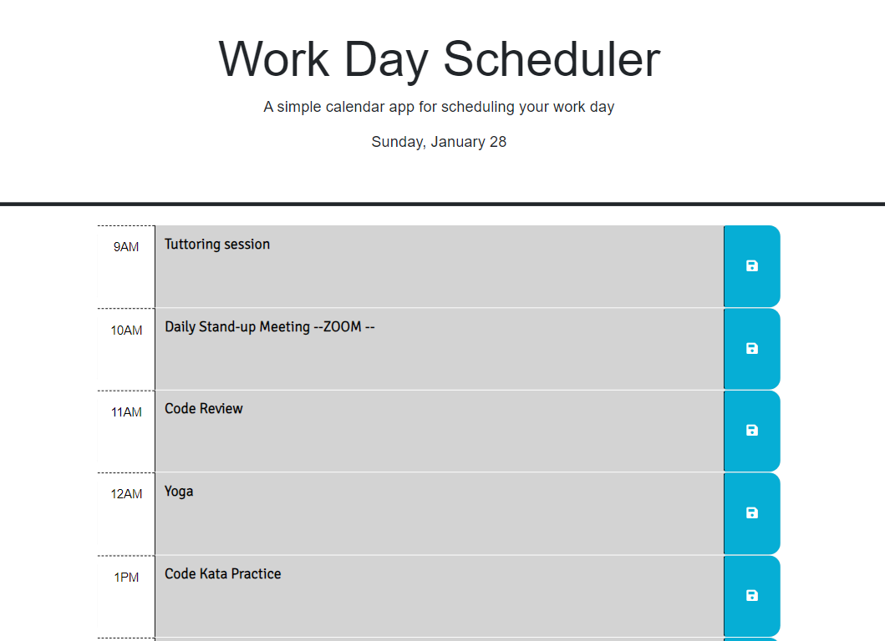
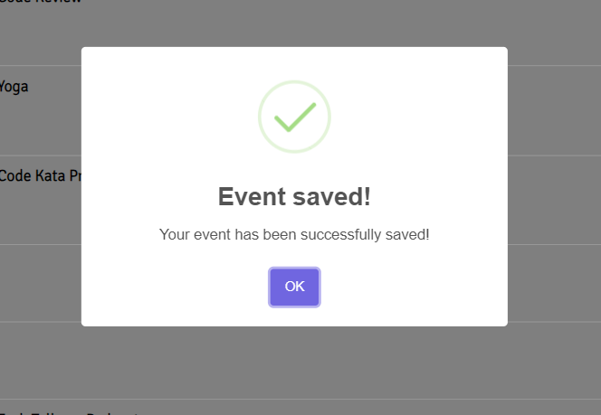

# 📅work-day-scheduler
This is the Challenge -05 related to Third-Party APIs

## Description
This project is a dynamic calendar application designed to help users manage their workday events. It provides an hourly breakdown of a typical workday, from 9am to 5pm, allowing users to save and track events for each hour. One of the key features of this application is its color-coded event system. Events are automatically updated with different colors based on their status: past events are one color, the current event is another, and future events are a different color. This visual cue provides an intuitive and efficient way for users to understand their schedule at a glance.

## Features

1. Dynamic Date and Time Display.
2. Responsive Design.
3. Hourly Event Planning.

## Table of Contents

- [Credits](#credits)
- [License](#license)
- [Website-Appearance](#website)

## Credits

N/A

## License

Please refer to the LICENSE in the repo.

## Website

Link to the live application: https://nathaliareyes.github.io/work-day-scheduler/

The following image shows the web application's appearance and functionality:

## Badges

## Thanks for stopping here!.

